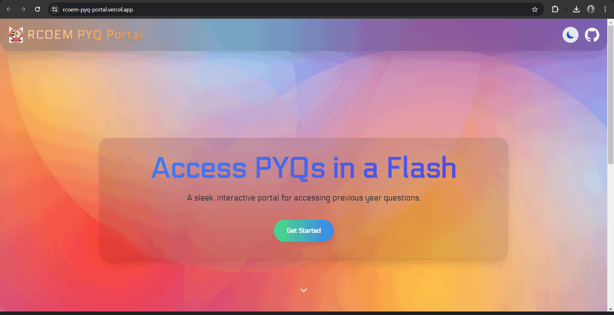

# **RCOEM PYQ Portal**

## **Problem & Motivation**
As a student at RCOEM, I noticed that many of my peers struggle with accessing Previous Year Question (PYQ) papers for their academic preparations. The challenges stem from the unique infrastructure and workflow in our college:

- **Difficulty Locating Files**:  
  The PYQ repository is fragmented across multiple folders on slow FTP servers, making it difficult to locate specific files for a subject or semester.

- **Time-Wasting Processes**:  
  Students spend excessive time searching and manually downloading PYQ files one by one.

- **FTP Server Limitations**:  
  FTP servers are often slow and inefficient, resulting in long download times even for small sets of files, which significantly hinders productivity.

### **Motivation**
I developed this project specifically to address these issues faced by students in our college. By automating and streamlining the process of accessing PYQs, I aimed to remove inefficiencies and make it easier for students to focus on their academic goals without being burdened by logistical challenges.

---

## **Solution Overview**
I built a pipeline to tackle these challenges and provide an intuitive web interface to simplify file access. Here’s how it works:

### **Pipeline Workflow**
1. **Automated Fetching**:  
   - PYQs are automatically fetched from the college's FTP servers, removing the need for manual intervention.  

2. **Local Organization**:  
   - The downloaded files are organized systematically and renamed based on subject names, semesters, and file conventions for clarity.  

3. **Compression**:  
   - Each subject's folder is compressed into a ZIP file, simplifying distribution and reducing storage overhead.  

4. **Cloud Storage (AWS S3)**:  
   - The organized ZIP files are uploaded to AWS S3 for secure and scalable storage.  
   - Files are stored under a standardized naming convention (e.g., `merged_subjects/SUBJECT_NAME.zip`).

5. **Frontend Distribution**:  
   - Students access the files via a React-based portal, where they can dynamically retrieve secure, time-limited download links for their required subject ZIP files.  

---

## **AWS Integration Details**
AWS services form the backbone of this project, enabling secure and efficient file management and delivery:

### **Cloud Storage (AWS S3)**
- **Bucket Configuration**:  
  I set up a dedicated S3 bucket to store all subject ZIP files under the `merged_subjects` prefix.  

- **Object Management**:  
  ZIP files are uploaded programmatically using JavaScript's `aws-sdk` package.  
  The naming convention ensures easy identification and retrieval (e.g., `merged_subjects/COMPUTER_NETWORK.zip`).  

- **Scalability**:  
  AWS S3 seamlessly scales to handle increasing numbers of files and users.  

- **Security**:  
  Files remain private by default and can only be accessed using pre-signed URLs, which are time-limited to prevent unauthorized sharing.  

### **Serverless Architecture**
- **AWS Lambda**:  
  - I implemented a Lambda function in JavaScript that normalizes subject names, matches them to files in S3, and generates pre-signed URLs for secure file access.  
  - This ensures low-latency operations and cost efficiency.  

- **API Gateway**:  
  - API Gateway acts as the bridge between the React frontend and AWS Lambda.  
  - It securely handles requests from the frontend and routes them to Lambda for processing.

---

## **Features**
- **Automated Workflow**:  
  - The entire process of fetching, organizing, compressing, and uploading PYQs happens automatically without manual effort.  

- **Secure File Access**:  
  - Files are served via pre-signed URLs, ensuring secure, time-limited downloads.  

- **Scalable and Reliable**:  
  - With AWS infrastructure, the system effortlessly handles growing user demands and file volumes.  

- **User-Friendly Portal**:  
  - Students can select subjects and download files quickly and easily through a React-based frontend.  

---

## **Technologies Used**
### **Backend**:
- JavaScript (to handle automation for FTP fetching, file organization, and compression)
- AWS Lambda + API Gateway (serverless backend functionality)
- AWS S3 (cloud storage for distributed file access)

### **Frontend**:
- React.js (to provide a user-friendly interface for file downloads)

## Website

You can access the website [here](https://rcoem-pyq-portal.vercel.app/).

---

## **Screenshots**

---

## **Disclaimer**
This project was created for educational purposes and is intended to help students in **RCOEM (Shri Ramdeobaba College of Engineering and Management)**. All rights to the PYQs belong to RCOEM.

---
